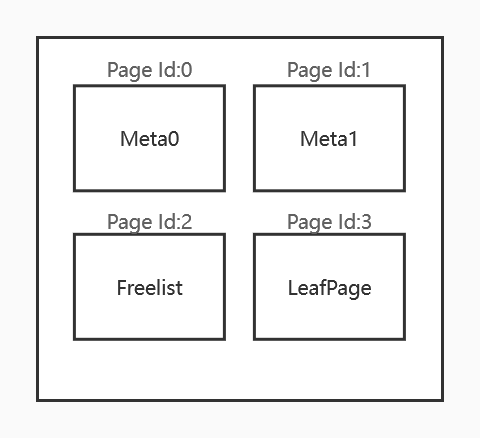
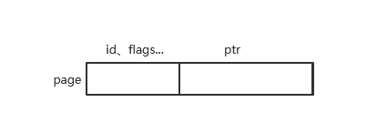
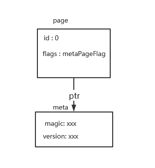
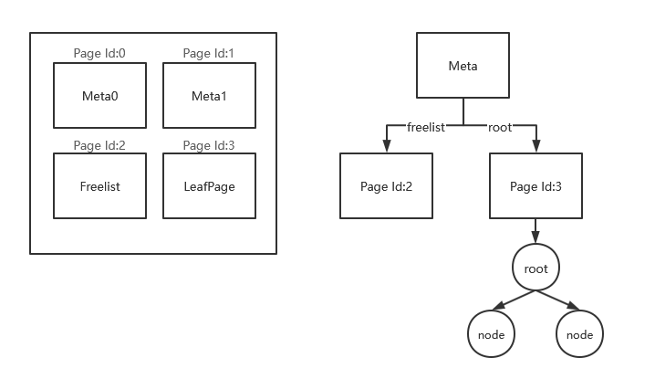
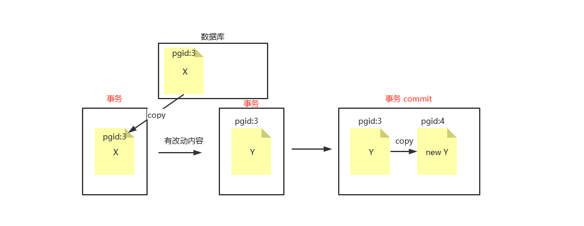
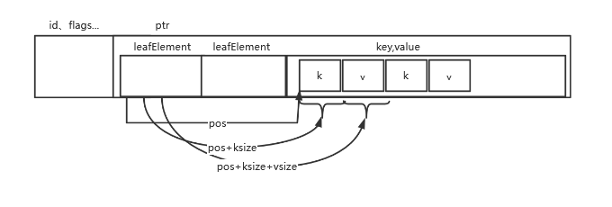
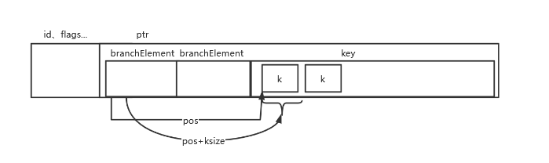

# 阅读建议

文章由浅入深，出现新概念会用一两句话介绍，而不用继续陷入分支细节。从数据库存储文件结构格式到如何保证文件正确（事务）的存储，全程围绕着下方第一块代码。
阅读时最好具备(Go、Java、C++)其中一门语言。一些少许的数据库知识，如果你还在处于不知道基础的 SQL 怎么写的阶段建议先学基础，再回来继续阅读。

BoltDB 整体很简单，没有 SQL ，没有复杂的内存管理，没有分布式，等等，只是一个纯粹的带简单事务的数据库。


# BoltDB 的介绍

**原介绍**  项目地址：[github](https://github.com/boltdb/bolt)

Bolt is a pure Go key/value store inspired by Howard Chu's LMDB project. The goal of the project is to provide a simple, fast, and reliable database for projects that don't require a full database server such as Postgres or MySQL.

Since Bolt is meant to be used as such a low-level piece of functionality, simplicity is key. The API will be small and only focus on getting values and setting values. That's it.

Bolt 一个 Go 语言的嵌入式 KV 数据库，支持多读一写的事务。它的底层是由B+树组织，这颗 B+ 树跟教科书的不一样， 它没有固定的数量的节点，叶子结点没有关联。
事务都在运行时内存存储，等待事务 Commit 时相关数据才进行落盘，如果事务提交阶段，在写入磁盘时突然宕机，会使用"备份"进行恢复上一个已写入磁盘的事务状态。Bolt 有 namespance 概念，相当于 MySQL 的表，叫做
Bucket（桶），Bucket 可以嵌套 子Bucket。
Bolt 核心代码很少 4k 左右，结构分明。下方是一段往数据库插入一条 **key**:foo **value**:bar 数据的操作。

```Go
//读取数据库文件
db, _ := bolt.Open("my.db", 0600, nil)
defer db.Close()
//创建一个写事务
tx, _ := db.Begin(true)
//在事务里创建Bucket
bucket := tx.Bucket([]byte("MyBucket"))
bucket.Put([]byte("foo"), []byte("bar"))
//事务提交
tx.Commit()
```

# BoltDB 的存储结构

## 磁盘存储布局
BoltDB 磁盘文件结构是内部是按页管理，为了避免浪费磁盘读取至内存 IO 切换，一个页面大小为 4096=2^12，跟磁盘扇区大小一致，一个磁盘扇区是磁盘读写最小单位。在代码体现为`Page.go`这个源码文件。
如上方代码`bolt.Open("my.db", 0600, nil)`，如果磁盘未创建即创一个 my.db 文件，第一次创建时会默认创建四个页，Meta0Page、Meta1Page、FreeList、LeafPage。
Meta 页为元数据页用于描述数据库文件中其他页在哪，FreeList 页用于管理事务释放后的空闲页面，LeafPage 为数据页面。等达到一定数据时会出现 BranchPage，作为索引页，它跟LeafPage是一种结构只不过用一个标记去区分。

下方图为数据库初始化时磁盘文件布局，[db.go#init()](https://github.com/boltdb/bolt/blob/fd01fc79c553a8e99d512a07e8e0c63d4a3ccfc5/db.go#L343-L387)
可以到这个方法看具体代码。
</br>

## 基础页面Page
所有的page都是基于这个结构构建，page这个数据结构分为两个部分，(id...)和ptr，前部分相当于描述这个页，后部分是页的具体内容。其他字段看注释很好理解，overflow 字段是因为一个树结点可能占用几个页面，它的原理是记录溢出页面数量，通过递增页面Id可访问到。在commit的时候才会分配这些页面。
```go
//页面类型
const (
	branchPageFlag   = 0x01
	leafPageFlag     = 0x02
	metaPageFlag     = 0x04
	freelistPageFlag = 0x10
)


type page struct {
    //页id 
    id       pgid
    //区分页类型
    flags    uint16
    //BranchPage和LeafPage数据元素数量
    count    uint16
    //溢出连续页面数量
    overflow uint32
    //具体数据
    ptr      uintptr
}
```

ptr无符号指针，指向内存。可以把内存当作大数组，而ptr存放的就是数组的index。Index+Size可以获取整个页内容。

</br>

page转换meta页样例。
```go
func (p *page) meta() *meta {
    return (*meta)(unsafe.Pointer(&p.ptr))  //&p.ptr=首地址+meta指针需要的内存大小
}
```
</br>
## Meta 页
```go
//db.go
type meta struct {
    magic    uint32 
    version  uint32 
    pageSize uint32  //页大小
    flags    uint32  //暂无使用  
    root     bucket //树的根节点
    freelist pgid    
    pgid     pgid  //当前最大页面id范围
    txid     txid  //事务id
    checksum uint64 
}
```
把 meta 分成四个部分 (magic、version,flags)、(root,freelist)、(txid,checksum)、(pgid)。第一部分用于校验文件是否正确，第二部分用于逻辑关联其他页（可以看到下方图），第三部分用于校验meta事务是否可用，第四部分属于资源管理。
Meta0 和 Meta1 是一样的结构，相当于备份，在事务Commit时，写入磁盘中崩溃可以使用其中一个进行恢复。

可以看到 root 字段是 bucket 类型，其实bucket里面包装了 pgid。从上文知道一个页是4096字节，那么访问数据库文件的 0x0000 至 0x1000 字节就是第一个 meta 页面，（4096+4096）0x1000 至 0x2000 是第二个页面，那么得到 meta 页面根据其他 pgid*4096 即可访问到其他页面数据。



有两个 meta 页很必要，事务有一个特性就是数据一致性，如果在一个事务中提交写入磁盘阶段，一部分数据写入了磁盘但是突然发生崩溃，导致另一部分相关的数据没有写入磁盘就会产生脏数据。数据库每次写入只使用一个meta页面，开启事务时候会复制一个meta页给事务，写入磁盘的时候是写到另外一个meta页面，这样不会干扰到之前的正常meta页面。在启动数据库时会校验 meta 是否完整，选择完整的 meta 进行恢复，可以看到下方代码。
```go
//db.go
func (db *DB) meta() *meta {
    metaA := db.meta0
    metaB := db.meta1
    //比较事务Id，事务Id是递增+1的那个最大的Id就为最新事务
    if db.meta1.txid > db.meta0.txid {
        metaA = db.meta1
        metaB = db.meta0
    }
    //最新的事务不一定可用，所以如果最新事务不可用就使用“备份”的。
   if err := metaA.validate(); err == nil {
        return metaA
   } else if err := metaB.validate(); err == nil {
        return metaB
   }
}
```
## Freelist Page
数据库文件内部是按页的单位管理，这就涉及到如何分配页和回收页（要释放旧的页，旧的页面是从数据复制到新事务）。事务提交的阶段会把树结点分写入到一个页或多个页（页大小4096字节），根据磁盘特性顺序写比随机写要快，所以在分配页面时如果有溢出页会开辟连续的页。



可以看到上方图事务修改后 pgid:3 的页面变成了脏页，会分配新的页面 pgid:4，从新刷入磁盘。这样可以达到事务隔离，旧的事务只看到 pgid:3 页面,而无法看到新事务的新页面（因为页面会由meta关联）。
```go
//freelist.go
type freelist struct {
    ids []pgid  //空闲页 id 列表
    pending map[txid][]pgid //每个事务将要释放的旧页面id
    cache   map[pgid]bool  //找所有空闲和待处理的页面id
}
```
## Left & branch Page
分配页面都是等待事务 commit 时调用 freelist.go#allocate() 方法才去分配，如果文件大小不够会开辟空间重新映射。 页面释放到 pending 后没有真正回收到 ids，需要等待下一个事务开启才会把上一个事务的旧页释放到空闲页。
Bucket 可以嵌套 子 Bucket ,是共用 leafPageElement 结构 flags 区分。


```go
type leafPageElement struct {
    flags uint32 //区分是数据结点还是子Bucket
    pos   uint32   
    ksize uint32
    vsize uint32
}
```

```go
type branchPageElement struct {
    pos   uint32  
    ksize uint32
    pgid  pgid   //指向下一个leaf或branch page
}
```
## 内存存储结构
磁盘文件保存的 page 结构，因为 page 结构的设计并没有树操作做处理，所以需要从 page 转换到 node 节点树结构。
page 转 node 的 read 方法实际上是调用 page 方法 例如获取 page 的 key 原理是 `page.ptr[&node+pos:ksize]`，然后把按数组方式存入 inodes。
```go
//page转node
func (n *node) read(p *page)
{
	//....
}

type node struct {
    bucket     *Bucket  //所属的Bucket
    isLeaf     bool     //Branch和Leaf是共用一个结点，用于区分
    unbalanced bool     //是否平衡
    spilled    bool     //是否分裂了
    key        []byte   
    pgid       pgid    //属于页
    parent     *node   //父结点
    children   nodes  //子结点
    inodes     inodes //内部元素 KV数组
}

type bucket struct {
    root     pgid   
    sequence uint64 
}

type Bucket struct {
    *bucket   //继承bucket 
    tx       *Tx               
    buckets  map[string]*Bucket 
    page     *page             
    rootNode *node              
    nodes    map[pgid]*node     
    FillPercent float64
}
```
# 资源管理

## 内存管理
Bolt 没有做独立的内存管理，而使用 mmap 去管理文件内存，mmap 是操作系统内存的管理内存方式。读取磁盘数据需要先读取到内存（磁盘和 CPU 的速度差异），但是磁盘文件总是比内存空间大，需要淘汰不需要缓存的磁盘页，让出内存给需要缓存的磁盘页，mmap 就是负责缓存和淘汰缓存。
它的原理是在磁盘开辟一块空间作为虚拟内存，里面存储着虚拟内存地址与物理地址的映射，内存会加载这一小块虚拟地址，操作时会得到虚拟地址。最终达到的效果就是文件不需要自己读取文件到内存，而是由操作系统去完成，操作文件跟操作内存一样。
```go
//bolt_windows.go
func mmap(db *DB, sz int) error {
    //... 
    db.data = ((*[maxMapSize]byte)(unsafe.Pointer(addr))) //data 是整个文件 mmap 映射
    db.datasz = sz
    return nil
}

//db.go
func (db *DB) page(id pgid) *page {
    pos := id * pgid(db.pageSize)
    return (*page)(unsafe.Pointer(&db.data[pos]))
}
//db.go
func (db *DB) mmap(minsz int) error {
    db.meta0 = db.page(0).meta()
    db.meta1 = db.page(1).meta()
}
```
实际上 meta 就是从 db.data 转换来的，其实就是 mmap 映射文件，所以希望在看 `tx.writeMeta()` 方法时不要惊讶，为什么写入的是文件，新的 meta 马上就可以读取到，而不用重新读取文件这种操作。
## 磁盘页管理
//TODO 页分配回收，事务回滚，
```go
//freelist.go
func (db *DB) allocate(count int) (*page, error) {
    var buf []byte
    if count == 1 {
        buf = db.pagePool.Get().([]byte)
    } else {
        buf = make([]byte, count*db.pageSize)
    }
    p := (*page)(unsafe.Pointer(&buf[0]))
    p.overflow = uint32(count - 1)
	
    if p.id = db.freelist.allocate(count); p.id != 0 {
        return p, nil
    }
	
    p.id = db.rwtx.meta.pgid
    var minsz = int((p.id+pgid(count))+1) * db.pageSize
    if minsz >= db.datasz {
        if err := db.mmap(minsz); err != nil {
            return nil, fmt.Errorf("mmap allocate error: %s", err)
        }
    }
    db.rwtx.meta.pgid += pgid(count)
    return p, nil
}
```
# B+树的操作

## 查找元素

## 添加元素

## 删除元素

## 树平衡

### 分裂
//分裂条件
### 合并
合并条件
# 事务

## 读事务

## 写事务

## 事务回滚
pending


参考文章</br>
[boltdb 源码分析-我叫尤加利](https://youjiali1995.github.io/storage/boltdb/) <br/>
[自底向上分析boltdb](https://www.bookstack.cn/read/jaydenwen123-boltdb_book/00fe39712cec954e.md)


